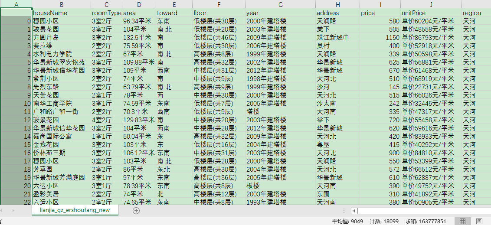

[链家](https://www.lianjia.com/)是一家集房产交易服务、资产管理服务为一体以数据驱动的价值链房产服务平台，公司业务覆盖租房、新房、二手房、资产管理、海外房产、互联网平台、金融、理财、后房产市场等领域。链家目前已覆盖北京、上海、广州、深圳、天津、成都、青岛、重庆、大连、合肥等28个地区，全国门店数量约8000家，旗下经纪人超过13万名。


## 一、数据来源

本文运用R语言来分析探究广州影响二手房市场房价的因素以及预测二手房的价格。借助于爬虫工具我们爬取了链家网广州地区的二手房交易信息。


所需要抓取下来的数据就是图片中的的内容，共爬取了广州11个区，每个区爬取再汇总，总共大约18000行（截止**2018/06/11**）。包括广州各个区每套二手房的小区名称、户型、面积、所属区域、楼层、朝向、售价及单价等。


 
### 数据说明

 链家网采集字段详细说明：

 |采集字段|字段含义|
 |---|---|
 |houseName|房源小区名字|
 |roomType|房屋户型| 
 |area|房屋面积| 
 |toward|房屋朝向| 
 |floor|房屋楼层| 
 |year|房屋建造时间|
 |address|房屋地址|
 |price|房屋价格|
 |unitPrice|房屋单价|
 |region|房屋所属区域|

## 二、数据清洗

这块的工作主要是对数据做一个探索性分析，将不符合要求的记录数据补齐或是剔除，对符合要求的记录进行格式转换、数据切分和重新整合。

```{r}
# 解决中文乱码
Sys.setlocale("LC_CTYPE", "chs")

rm(list=ls())

# 导入包
library(ggplot2)
library(stringr)
library(RColorBrewer)
library(ggrepel)

data <- read.csv('mywork/data/lianjia_gz_ershoufang_new.csv', header = T)
head(data)
```

```{r}
# 查看数据类型
str(data)
```

```{r}
# 删除第一列
data <- data[, -1]

# 提取并转换数据格式
data$area <- as.numeric(sub(pattern = "平米", replacement = "", data$area))
data$floor <- ifelse(substring(data$floor, 1, 3) %in% c('低楼层', '中楼层', '高楼层'), substring(data$floor, 1, 3), '其他')
data$unitPrice <- as.numeric(sub(pattern = "单价(.*)元/平米", replacement = "\\1", data$unitPrice))
data$year <- ifelse(as.numeric(substring(data$year, 1, 4)) %in% c(1950:2100), substring(data$year, 1, 4), '其他')

data$floor <- as.factor(data$floor)
data$year <- as.factor(data$year)

# 删除NA行
data <- na.omit(data)

# 数据清洗后结果
head(data)
```

```{r}
# 查看数据清洗后数据类型
str(data)
```

## 三、数据分析

### 二手房各区房源数量分布

```{r}
# 先用table()统计出各区房子数量
amount <- data.frame(table(data$region))

ggplot(data = amount, mapping = aes(x = reorder(Var1, -Freq),y = Freq))+
    # 生成标题
    ggtitle('各区房源数量分布') +
    # 生成条形图，每个柱的宽度0.8，填充'#FF9999'的颜色
    geom_bar(stat = 'identity', fill = "#4393C3") + 
    # 标题居中
    theme(plot.title = element_text(hjust = 0.5)) + 
    # 在条形图上标注数字
    geom_text(aes(label = Freq),position = position_stack(vjust = 1.05)) +
    # 横轴标签'各区'
    xlab('region') + 
    # 纵轴标签'数量'
    ylab('count')
```

总体来看，天河区、海珠区、番禺区、白云区二手房市场可谓相当活跃，这4个区的房源数量远远拉开其他区。同是老城区的越秀区和荔湾区却没有那么多是否与GDP高低相关？

为什么天河区、海珠区拥有较多的房源，同是老城区的越秀与荔湾却只有海珠的1/2？我们分别对海珠区和荔湾区两个区的房屋建造时间分布图画出来。

```{r}
# 海珠区
haizhu = data[6511:9448, ]

ggplot(haizhu, aes(year))+
  geom_bar(stat = 'count', position = 'dodge', width = 0.8, fill = "#4393C3" )+
  ggtitle('海珠区房屋建造时间分布')+
  theme(plot.title = element_text(hjust = 0.5)) + theme(axis.text.x = element_text(angle = 45, hjust = 0.5, vjust = 0.5))
```
```{r}
#越秀区
yuexiu = data[3001:4890, ]

ggplot(yuexiu, aes(year)) +
  geom_bar(stat = 'count', position = 'dodge', width = 0.8, fill = "#4393C3")+
  ggtitle('越秀区房屋建造时间分布')+
  theme(plot.title = element_text(hjust = 0.5)) + theme(axis.text.x = element_text(angle = 45, hjust = 0.5, vjust = 0.5))
```

由房屋建造时间分布图可以看到，海珠区在1990-2010年一直发展房地产，吸引了大量人口，房地产市场火爆；对比越秀，越秀需要保护文物古迹，用于可用于商业建房的地方可选择性少，因此建房少。

天河区、海珠区、番禺区、白云区这4个区的房源数量远远拉开其他区。是否与GDP高低相关？下面我们对各区GDP和房源数量做相关性验证。由[广州统计局](http://www.gzstats.gov.cn/)网站公布的数据显示，其各区GDP排名及其值如下：

> GDP排名：天河、黄埔、越秀、番禺、白云、海珠、南沙、花都、荔湾、增城、从化
>
> GDP值：4317.71, 3209.53, 3193.42, 1948.32, 1782.94,1740.31, 1391.89, 1276.39, 1169.89, 1072.30, 400.44

房源数量：

```{r}
sort(table(data$region), decreasing = T)
```

```{r}
# GDP： 天河、黄埔、越秀、番禺、白云、海珠、南沙、花都、荔湾、增城、从化
 GDP <- c(4317.71, 3209.53, 3193.42, 1948.32, 1782.94, 1740.31, 1391.89, 1276.39, 1169.89, 1072.30, 400.44)
#房源数：天河、黄埔、越秀、番禺、白云、海珠、南沙、花都、荔湾、增城、从化 
house_amount <- c(3000, 1013, 1865, 2952, 2856, 2986, 28, 613, 1596, 983, 24)

GDP_house <- data.frame(GDP, house_amount)

ggplot(data = GDP_house, mapping = aes(x = GDP, y = house_amount)) + 
    ggtitle('广州各区GDP和房源数量图') +
    # 散点的大小
    geom_point(size = 2) +
    # 背景设置为透明
    theme(plot.title = element_text(hjust = 0.5)) 
```

由图可知，GDP和房源数量呈正相关的关系。对其进行线性回归拟合：

```{r}
ggplot(data = GDP_house, mapping = aes(x = GDP, y = house_amount)) + 
    ggtitle('广州各区GDP和房源数散点图') +
    geom_point(size = 2) +
    theme( plot.title = element_text(hjust = 0.5)) +
    # 线性拟合
    geom_smooth(method = 'lm')
```

阴影区域是线性回归x所对应的y的置信区间域，如果散点都在阴影区域，则说明拟合效果好。从图中可知11个中有5个点是在外面的。说明拟合不好线性相关性强的证据不充分，即相关性比较弱。

因为变量数目少，不能确定其数据分布，所以这里用**Kendall rank correlation test**。计算相关系数 $\rho$ ：

```{r}
cor.test(x=GDP, y=house_amount, method = "kendall")
```
相关系数 $\rho$ 为00.4545455，p-value > 0.05，即原假设成立。

**结论**：各区房源与GDP存在弱相关性。

### 二手房户型分布

```{r}
#drops <- c("叠拼别墅", "独栋别墅", "联排别墅", "双拼别墅")
data_type <- data.frame(table(data$roomType))
data_type <- data_type[!grepl("别墅", data_type$Var1), ]
ggplot(data = data_type, mapping = aes(x = reorder(Var1, -Freq), y = Freq)) +
  ggtitle('二手房户型分布') +
  geom_bar(stat = 'identity', fill = "#4393C3") + 
  theme(plot.title = element_text(hjust = 0.5), axis.text.x  = element_text(angle = 60, hjust = 0.5, vjust = 0.5)) + 
  geom_text(aes(label = Freq), position = position_stack(vjust = 1.1), angle = 60) + 
  xlab('户型') + 
  ylab('套数')
```

```{r}
# 观察前10是哪些户型
typetop = sort(summary(data$roomType), decreasing = T)
typetop[1:10]

```
```{r}
r3h2 <- data[which(data$roomType=="3室2厅"), ]
summary(r3h2$area)
```

```{r}
summary(r3h2$unitPrice)
```

我们发现只有少数几种的户型数量比较多，其余的都非常少，明显属于长尾分布类型（严重偏态）3室2厅户型数量最多，其次是2室1厅。3室2厅平均面积：105.5平方米，平均价格39076元/平方。

### 二手房面积分布

```{r}
# Histogram overlaid with kernel density curve
ggplot(data, aes(x=data$area)) + 
    # 使用density代替y轴
    geom_histogram(aes(y=..density..), binwidth=20, fill="#0000FF") +
    # 重叠部分采用透明设置
    geom_density(alpha=.5, fill= "#B2182B")  
```
#### 正态性检验

+ Kolmogorov-Smirnov Test（D检验）

这是对经验分布的拟合检验，检验的是经验分布函数和假设总体分布函数的差异，适应于大样本。

```{r}
# R 语言自带的正态性检测（Kolmogorov-Smirnov 方法）
ks.test(data$area, "pnorm", mean = mean(data$area), sd = sqrt(var(data$area)))
```

由于p-value < 0.05，所以拒绝原假设，二手房面积分布不符合正态分布。

```{r}
data_area <- data$area

# 把0-50平米的算作50
data_area[data_area < 50] <- 50
# 把50-100平米的算作100
data_area[data_area>50 & data_area<100] <- 100
# 把100-150平米的算作150
data_area[data_area>100 & data_area<150] <- 150
# 把150-200平米的算作200
data_area[data_area>150 & data_area<200] <- 200
# 把200-250平米的算作250
data_area[data_area>200 & data_area<250] <- 250
# 把250平米以上的算作300
data_area[data_area>250] <- 300

data_area <- data.frame(table(data_area))
ggplot(data = data_area, mapping = aes(x = reorder(data_area, -Freq),y = Freq))+
    ggtitle('二手房面积分布')+
    geom_bar(stat = 'identity', fill = "#4393C3") + 
    theme(plot.title = element_text(hjust = 0.5), axis.text.x  = element_text(angle = 45, vjust = 0.5)) + 
    geom_text(aes(label = Freq),position = position_stack(vjust = 1.05))+
    xlab('面积') + 
    ylab('count')
```

```{r}
# 面积总体情况
summary(data$area)
```

二手房面积总体平均为：92.06平方米。

### 房屋朝向分布

```{r}
ggplot(data, aes(toward))+
    geom_bar(stat = 'count', position = 'dodge', width = 0.8, fill = "#4393C3")+
    geom_text(stat = "count", aes(label = ..count..), position = position_stack(vjust = 1.08))
```

国人普遍有坐南朝北的思想，所以南、北朝向房屋数量多也就不足为奇了。

### 地址分布

```{r}
addresstop15 = sort(summary(data$address), decreasing = T)[1:15]
addresstop15
```

其中，番禺的市桥，黄埔的区府，白云的金碧、金沙洲房源较多。**为什么市桥的房源最多呢？**

- 市桥是番禺区的中心，而番禺区的房源数在广州排第3，所以自然而然是有可能最多的；

- 依托中心城区的区位优势和拥有地铁和密集公路网的优越的交通条件，所以可能更加完善更加宜居。

### 楼层分布

```{r}
ggplot(data, aes(floor))+
    geom_bar(stat = 'count',position = 'dodge', width = 0.5, fill =  "#4393C3")+
    geom_text(stat = "count",aes(label = ..count..),position = position_stack(vjust = 1.03))+
    ggtitle('二手房楼层分布')+
    theme(plot.title = element_text(hjust = 0.5))
```

中楼层分布较多，中楼层采光好，环境也好，相对高楼层便宜，是大多数人的首选之一。

### 房屋建造时间分布

```{r}
ggplot(data, aes(year))+
  geom_bar(stat = 'count', position = 'dodge', width = 0.8, fill = "#4393C3")+
  ggtitle('二手房房屋建造时间分布') + theme(plot.title = element_text(hjust = 0.5), axis.text.x = element_text(angle = 60, hjust = 0.5, vjust = 0.5), legend.position = "bottom")
```

由图可知，2000年附近有一个建造高峰，另外值得注意的是其他列数量最多，可能原因是房主没有誊写或者已经忘记。

### 总价格分布

```{r}
ggplot(data, aes(price))+
    geom_bar(stat = 'count', position = 'dodge', width = 100, fill = "#4393C3")+
    ggtitle('二手房总价格分布')+
    theme(plot.title = element_text(hjust = 0.5))
```

#### 正态性检验

```{r}
ks.test(data$price, "pnorm", mean = mean(data$area), sd = sqrt(var(data$area)))
```

由于p-value < 0.05，所以二手房价格分布不符合正态分布。

```{r}
summary(data$price)
```

其图像是右偏的，说明均值大于中位数，有右偏大奇异点。

```{r}
sum(data$price > 1000)*1.0/length(data[, 1]) 
```

其房价均值在370w左右，而2.121009%的二手房超过1000w，广州果然一线城市。其中房价最贵的区域主要分布在珠江新城。

```{r}
# data[data$price > 1000]
data[data$price > 3000, ]
```

### 单价分布
```{r}
ggplot(data, aes(unitPrice))+
  geom_bar(stat = 'count', position = 'dodge', width = 4000, fill = '#009966')+
  ggtitle('二手房单价分布')+
  theme(plot.title = element_text(hjust = 0.5))
```

```{r}
summary(data$unitPrice)
```

```{r}
summary(data[data$unitPrice > 100000, ]$region)
```

房价超过10w以上的主要分布在天河和越秀。

```{r}
summary(data[data$unitPrice > 100000, ]$address)
```

```{r}
sum(data$unitPrice < 50000)*1.0 / length(data[, 1])
```
77.85778%的房单价处在5w以下。


### 各城区二手房数据概览

```{r}
avg_price = aggregate(data$unitPrice,by=list(data$region), mean)

ggplot(avg_price, aes(x = reorder(Group.1, -x), y  = x, group = 1)) + 
  geom_area(fill = "#F4A582") + geom_line(color = "#B2182B", size = 2) + 
  geom_point() + xlab('') + ylab('均价') + geom_point(color = I("red")) +
  ggtitle('各区房屋均价分布')+
  geom_text_repel(aes(label = x), position = position_stack(vjust = 1.08))+
  theme(plot.title = element_text(hjust = 0.5))
```

很明显，广州二手房价格最高的三个地区为：天河、越秀和海珠，均价都在3.5W以上，价格最低的三个地区为：南沙、花都和从化。

### 各城区二手房总价分布箱线图

```{r}
ggplot(data,aes(region,price))+
    geom_boxplot(outlier.color="darkgreen", fill="grey80")+ylim(0, 2000) +
    ggtitle('各区总价箱线图') +
    theme(plot.title = element_text(hjust = 0.5), legend.position = "bottom")
```


各区的中位数都大致在500W以下，500W一套房，首付3成150W，剩下的350W按揭贷款，2018年6月金融机构一年期贷款基准利率下调0.25个百分点至4.35%；30年还款，每月要还17423.41元。

### 各城区二手房单价分布箱线图
```{r}
ggplot(data, aes(region,unitPrice))+
    geom_boxplot(outlier.colour="darkgreen", fill="grey80") + ylim(0,100000)+
    ggtitle('各区单价箱线图') +
    theme(plot.title = element_text(hjust = 0.5), legend.position = "bottom")
```

## 二手房数据的简单聚类分析
这么多的房子，我该如何把它们分类呢？即应该把哪些房源归为一类？这就要用到聚类算法了，这里使用简单k-means算法进行聚类分析。根据聚类原则：**组内差距要小，组间差距要大**。我们绘制不同类簇下的组内离差平方和图，聚类过程中，我们选择面积、房价和单价三个数值型变量：


```{r}
tot.wssplot <- function(data, nc, seed=123) {
  #假设分为一组时的总的离差平方和              
  tot.wss <- (nrow(data)-1)*sum(apply(data, 2, var)) 
  for (i in 2:nc){
    #必须指定随机种子数
    set.seed(seed) 
    tot.wss[i] <- kmeans(data, centers=i, iter.max = 100)$tot.withinss
  }
  plot(1:nc, tot.wss, type="b", xlab="Number of Clusters",
       ylab="Within groups sum of squares", col = 'blue',
       lwd = 2, main = 'Choose best Clusters')
}
# 绘制不同聚类数目下的组内离差平方和
standard = data.frame(scale(data[,c('area', 'price', 'unitPrice')]))
myplot <- tot.wssplot(standard, nc = 15)
```

当把所有样本当作一类时，离差平方和达到最大，随着聚类数量的增加，组内离差平方和会逐渐降低，直到极端情况，每一个样本作为一类，此时组内离差平方和为0。从上图看，聚类数量在5次以上，组内离差平方降低非常缓慢，可以把拐点当作5，即可以分成五类。

```{r}
clust = kmeans(x=standard, centers = 5, iter.max = 100)
table(clust$cluster)
```

按照聚类的结果，查看各类中的区域分布：

```{r}
#按照聚类的结果，查看各类中的区域分布：
table(data$region, clust$cluster)
```

各户型的平均面积：

```{r}
aggregate(data$area, list(data$roomType), mean)
```

按聚类结果，比较各类中房子的平均面积、平均价格和平均单价：

```{r}
head(data)
aggregate(data[, c(3, 8, 9)], list(clust$cluster), mean)
```

大体上而言，我们可以将1.8w套广州二手房划分为以下几类：

- 第1类. 精装小户型。如聚类第4类，房子小(平均75平)但价格不菲(单价4.6W)，在海珠区和天河区较多，多是地段优越的精装小户型，以2室1厅和2室2厅为主，广州这样的房源较多；
- 第2类. 城郊大户型。如聚类第1类，在番禺区、白云区较多，平均面积在140平，但总价并不夸张，单价也是5类房型中较低的，可以预见的是这类房源并不在市中心或者离市中心较远；
- 第3类. 单身公寓或大众蜗居型。如聚类第5类，和第1类一样，该类房型也是广州的主流二手房类型之一，面积略小于精装小户型，价格相对便宜，是在城市打拼的年轻人的首选。在番禺区、海珠区、白云区、荔湾区、黄埔区、增城区、天河区都特别多。广州这样的房源最多；
- 第4类. 豪宅型。如聚类第3类，房子大(平均220多平)价格超贵(单价6.8W)，在天河区、海珠区、越秀区较多；
- 第5类 地段型。如聚类的第2类，地段极好，在地铁口的几率极大，算不上大户型但价格惊人，在海珠区、天河区、越秀区较多

```{r}
# 绘制面积与单价的散点图，并按聚类进行划分

ggplot(data, mapping = aes(x = area, y = unitPrice, color = factor(clust$cluster))) + 
  geom_point(pch = 20, size = 3)
```

接下来借助于已有的数据（房价、面积、单价、楼层、户型、聚类水平）构建线性回归方程，用于房价因素的判断及预测。由于数据中有离散变量，如户型、楼层等，由于其是离散型数据需要对其进行哑变量处理。


```{r}
library(caret)

# 构造楼层和聚类结果的哑变量
# 将几个离散变量转换为因子，目的便于下面一次性处理哑变量
dataN <- data[, -c(1, 4, 6, 7, 10)]
dataN$cluster <- factor(clust$cluster)

# 筛选出所有因子型变量
factors <- names(dataN)[sapply(dataN, class) == 'factor']

# 将因子型变量转换成公式formula的右半边形式
formula <- as.formula(paste('~', paste(factors, collapse = '+')))
dummy <- dummyVars(formula = formula, data = dataN)
pred <- predict(dummy, newdata = dataN)
head(pred)
```
```{r}
# 将哑变量规整到dataN数据集中
final_house <- cbind(dataN, pred)

# 筛选出需要建模的数据
model.data <- subset(final_house, select = c(2, 4, 5, 10, 11, 14, 15, 18, 19, 24, 29, 49, 50, 52, 53, 54, 55, 56))

# 直接对数据进行线性回归建模
fit <- lm(price ~ ., data = model.data)

summary(fit)
```

整体看上去还行，只有1室1厅和1室0厅的房型参数不显著，其他均在0.01置信水平下显著。使用线性回归是有假设前提的，即因变量满足正态或近似于正态分布，前面说过，房价明显在样本中是偏态的，并不服从正态分布，所以这里使用**COX-BOX变换**处理。根据**COX-BOX变换**的lambda结果，我们针对y变量进行转换。

```{r}
# Cox-Box转换
library(car)

powerTransform(fit)
```
根据结果显示，0.3951325非常接近0.5，查表将二手房的价格进行开方变换。

```{r}
fit1 <- lm(sqrt(price) ~ .,data = model.data)

summary(fit1)
```

这次的结果就明显比fit好很多，仅有聚类中的cluster.1在0.55置信水平下显著，其余变量均在0.05置信水平下显著，而且调整的R方值也提高到了96.2%，即这些自变量对房价的解释度达到了96.2%。

## 总结

最后我们再看一下，关于最终模型的诊断结果：

```{r}
# 使用plot方法完成模型定性的诊断
opar <- par(no.readonly = TRUE)

par(mfrow = c(2,2))

plot(fit1)

par(opar)
```

从上图看，基本上满足了线性回归模型的几个假设，即：残差项服从均值为0（左上），标准差为常数（左下）的正态分布分布（右上）。基于这样的模型，我们就可以有针对性的预测房价啦~


*参考文献* 

- *[广州二手房市场数据分析](https://zhuanlan.zhihu.com/p/34639593)*
